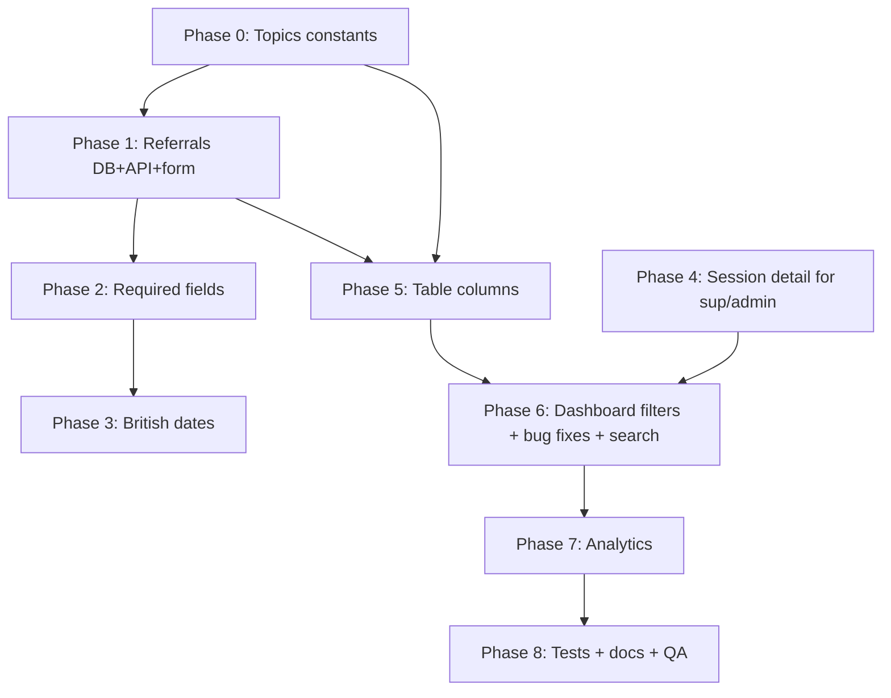

# Implementation Plan — Session Form, Dashboard & Analytics Changes

This document is a step-by-step implementation plan derived from the change request.
It is grouped into phases. Each step states **what** to change, **where** (file paths),
and **how** to achieve it.

## Decisions locked in (from clarification)

- **Topics:** ADD the 9 new topics alongside the existing 7 (do not remove old ones). Keep the existing `other` option.
- **Existing session rows:** leave old topic values as-is (no data migration / remapping).
- **Village vs District:** sessions only store `district`. The "Village" column is dropped; District is sufficient everywhere.

## Stack reference (already in repo)

- Client: React + Vite, react-hook-form + Zod (`zodResolver`), TanStack Table, shadcn/ui, axios, React Query.
- Server: Node + Express, Drizzle ORM + Postgres, Zod validation.
- Topics/Districts are TypeScript `as const` arrays + Zod enums mirrored on client (`client/src/lib/constants.ts`) and server (`server/src/constants/index.ts`) — **not** Postgres enums.
- Dates: stored as `date` (`YYYY-MM-DD`); displayed via `client/src/lib/session-format.ts`.

---

## Phase 0 — Shared constants (topics)

Goal: make the 9 new topics available app-wide. Do this first because the form, table, filters, and analytics all read from the same lists.

1. **Add the 9 new topic slugs** to the `TOPIC` array in BOTH files (keep order: existing 7 first, then new 9, with `other` kept). Suggested slugs:
   - `human_body_changes`, `puberty`, `menstruation`, `hiv_sti_prevention`, `reproduction_contraceptives`, `relationships`, `power_consent`, `gender`, `violence`.
   - Files: [client/src/lib/constants.ts](client/src/lib/constants.ts) (`TOPIC` at lines 51-59), [server/src/constants/index.ts](server/src/constants/index.ts) (`TOPIC` at lines 68-77).
2. **Add display labels** for the new slugs in `TOPIC_OPTIONS` ([client/src/lib/constants.ts](client/src/lib/constants.ts) lines 140-148):
   - "Human Body and Changes", "Puberty", "Menstruation", "HIV and STI prevention", "Reproduction and contraceptives", "Relationships", "Power and Consent", "Gender", "Violence".
3. Because `zTopic = z.enum(TOPIC)` derives from the array, server validation, client schema, and the column varchar(64) automatically accept the new values. **No DB migration needed for topics.**

Verification: open the New Session form and confirm 16 topics + Other appear in the dropdown.

---

## Phase 1 — Referral fields (DB + API + form)

Goal: capture referrals on each session.

### 1.1 Database

1. Add three columns to the sessions table in [server/src/db/schema/sessions.ts](server/src/db/schema/sessions.ts):
   - `referralsMade boolean("referrals_made").notNull().default(false)`
   - `nReferrals integer("n_referrals").notNull().default(0)`
   - `referralReason text("referral_reason")` (nullable)
2. Generate a Drizzle migration (`npm run db:generate` style — confirm script in `server/package.json`) creating `server/drizzle/0004_add_referrals.sql`. Defaults keep existing rows valid.
3. Apply migration locally and note it must run on Render (the server deploy) as part of release.

### 1.2 Server validation & service

1. Extend the Zod body schema in [server/src/modules/sessions/sessions.schema.ts](server/src/modules/sessions/sessions.schema.ts):
   - `referralsMade: z.boolean()`
   - `nReferrals: z.number().int().min(0)`
   - `referralReason: z.string().optional()`
   - Add a `superRefine`: if `referralsMade === true` then `nReferrals >= 1` and `referralReason` non-empty; if `false` then force `nReferrals = 0` and `referralReason` optional.
2. Persist the new fields in `createForWorker` / update flows in [server/src/modules/sessions/sessions.service.ts](server/src/modules/sessions/sessions.service.ts) (mirror the existing field-mapping at lines 57-73).

### 1.3 Client types & schema

1. Add the fields to `CreateSessionRequest` and `SessionDto` in [client/src/types/session.ts](client/src/types/session.ts).
2. Extend the Zod form schema + defaults in [client/src/lib/session-schema.ts](client/src/lib/session-schema.ts):
   - `referralsMade` (boolean, required), `nReferrals` (required numeric, string→number transform like the other counts), `referralReason` (string).
   - In `superRefine` (lines 81-115): require `nReferrals >= 1` and non-empty `referralReason` only when `referralsMade` is true.
   - Add defaults in `sessionFormDefaultValues` (lines 121-137): `referralsMade: false`, `nReferrals: ""`, `referralReason: ""`.

### 1.4 Form UI

In [client/src/features/worker-sessions/components/SessionForm.tsx](client/src/features/worker-sessions/components/SessionForm.tsx):

1. Add a "Referrals made?" yes/no control (radio or Select). Use `useWatch` on `referralsMade`.
2. When "yes": show "Number of referrals" (numeric) and "Reason for referral" (text) — both required.
3. When "no": hide/disable those two fields and reset them.

---

## Phase 2 — Make all session fields required (except notes)

Goal: every field required except `keyIssues` (notes).

1. Audit [client/src/lib/session-schema.ts](client/src/lib/session-schema.ts): `sessionDate`, `district`, `topic`, `durationMin`, and all 6 participant counts are already required. Confirm and keep.
2. `topicOther`: keep conditionally required (only when `topic === "other"`) — already handled at lines 81-89.
3. Referral fields: required per Phase 1.3.
4. `keyIssues` stays optional.
5. Mirror identical rules on server in [server/src/modules/sessions/sessions.schema.ts](server/src/modules/sessions/sessions.schema.ts) so the API rejects missing required fields.

---

## Phase 3 — British date format

Goal: display dates as `DD/MM/YYYY` (British) without hardcoding logic everywhere.

1. Update `formatSessionDate` in [client/src/lib/session-format.ts](client/src/lib/session-format.ts) (lines 5-16) to pass an explicit locale instead of `undefined`:
   - `new Date(year, month-1, day).toLocaleDateString("en-GB", { day: "2-digit", month: "short", year: "numeric" })` (e.g. `22 Jun 2026`), or `{ day:"2-digit", month:"2-digit", year:"numeric" }` for strict `22/06/2026`.
2. This single utility is used by the worker session list, detail page, and dashboard tables, so changing it once updates all views.
3. The native `<Input type="date">` in the form follows the OS locale and always submits ISO — leave it; no change required. (Note in UI copy if needed.)

---

## Phase 4 — Supervisors & admins can open individual sessions

Goal: clicking a session row opens a read-only detail view for supervisor and admin.

### 4.1 Server

1. Add `GET /supervisor/sessions/:id` (scope-checked to the supervisor's org) and `GET /admin/sessions/:id` (any session).
   - Routes: [server/src/modules/supervisor/supervisor.routes.ts](server/src/modules/supervisor/supervisor.routes.ts), admin equivalent.
   - Service: reuse `getSessionOrThrow` + `assertWorkerInSupervisorOrg` (already in [server/src/modules/sessions/sessions.service.ts](server/src/modules/sessions/sessions.service.ts), lines 143-160).

### 4.2 Client

1. Add API functions `getSession(id)` in `client/src/api/supervisor-api.ts` and `client/src/api/admin-api.ts`, plus React Query hooks.
2. Add routes `/supervisor/sessions/:id` and `/admin/sessions/:id` in [client/src/router/index.tsx](client/src/router/index.tsx).
3. Create a dashboard session-detail page reusing the field layout from [client/src/features/worker-sessions/SessionDetailPage.tsx](client/src/features/worker-sessions/SessionDetailPage.tsx) (include attendance breakdown, total reached, referrals, notes).
4. Make table rows navigable: in [client/src/features/dashboard/components/sessions-columns.tsx](client/src/features/dashboard/components/sessions-columns.tsx) make the Session ID cell a `<Link>`, or add an onRowClick to the data table.

---

## Phase 5 — Sessions table view (columns)

Goal: target columns = Session ID, Worker ID, Date, District, Topic, Total Reach, **Total Referrals**, Duration, Notes. Drop Village.

1. In [client/src/features/dashboard/components/sessions-columns.tsx](client/src/features/dashboard/components/sessions-columns.tsx):
   - Keep District (already labelled "District", lines ~50-60).
   - Add a **Total Referrals** column (accessor `nReferrals`) immediately after **Total reached**.
   - Optionally add a **Notes** column (`keyIssues`) — truncated with tooltip (target table lists Notes).
   - Confirm topic column uses `formatSessionTopic` which reads `TOPIC_OPTIONS`, so new topics render correctly.
2. No Village column anywhere (decision locked).

---

## Phase 6 — Supervisor dashboard fixes & filters

### 6.1 Add District + Worker ID + Topic filters

Currently only a District filter + free-text search exist (client-side) in [client/src/features/dashboard/components/SessionsDataTable.tsx](client/src/features/dashboard/components/SessionsDataTable.tsx) and `SessionsTableToolbar.tsx`.

1. In `SessionsTableToolbar.tsx` add:
   - **Worker ID** filter — a Select populated from the distinct worker IDs in the loaded sessions (or keep search; see 6.3).
   - **Topic** filter — a Select from `TOPIC_OPTIONS` + "All topics".
   - Keep the District Select.
2. Extend the `useMemo` filter in `SessionsDataTable.tsx` (lines 36-53) to also match `topic` and `workerId` selections.
3. Thread the new filter state through [client/src/features/dashboard/pages/supervisor/SupervisorSessionsPage.tsx](client/src/features/dashboard/pages/supervisor/SupervisorSessionsPage.tsx) (and the admin page that reuses the table).

### 6.2 Fix "suddenly logged out / network error"

Root cause (confirmed): on `401` the axios interceptor only clears the token; it does not invalidate the cached `me` query or redirect, so the page shows a raw error while the sidebar still shows the user.

1. In [client/src/api/client.ts](client/src/api/client.ts) (response interceptor, lines ~20-30): on 401 (non-login), clear token **and** trigger an auth reset — e.g. dispatch an event / call a shared handler that invalidates `meKeys.all` and redirects to `/login`.
   - Cleanest: export a small `onUnauthorized()` callback registered from the app root that does `queryClient.removeQueries({ queryKey: meKeys.all })` + `window.location.assign("/login")`.
2. In [client/src/features/dashboard/pages/supervisor/SupervisorSessionsPage.tsx](client/src/features/dashboard/pages/supervisor/SupervisorSessionsPage.tsx) error block (lines ~46-57): distinguish `status === 0` (network) vs `401` (session expired) and show friendlier copy + retry.
3. Verify deployment: `render.yaml` deploys only the server. Confirm the client's `VITE_API_BASE_URL` points at the deployed API and CORS allows it (a wrong base URL / CORS is the other "Network Error" cause). Document the expected env value.

### 6.3 Fix search ignoring topic

Search currently matches only `sessionId` and `workerId` (`SessionsDataTable.tsx` lines 36-53).

1. Extend the filter predicate to also match the **topic label** (`formatSessionTopic(session)`), so typing a topic name finds rows. Worker ID already works; this restores topic search.
2. If a dedicated Topic dropdown is added (6.1), keep free-text search matching session ID + worker ID + topic label.

---

## Phase 7 — Analytics page

Goal: build the supervisor analytics screen (currently a stub at [client/src/features/dashboard/pages/supervisor/SupervisorAnalyticsPage.tsx](client/src/features/dashboard/pages/supervisor/SupervisorAnalyticsPage.tsx)). Backend `GET /supervisor/analytics` exists but returns limited aggregates.

### 7.1 Add a charting library

1. Install `recharts` in `client/`. Lazy-load chart components with `React.lazy`/dynamic import to keep the main bundle small (per repo React performance rules).

### 7.2 Extend backend analytics

Extend the aggregation in [server/src/modules/sessions/sessions.repository.ts](server/src/modules/sessions/sessions.repository.ts) (`aggregateByWorkerIds`, lines 97-128) and the shaping in [server/src/modules/sessions/sessions.service.ts](server/src/modules/sessions/sessions.service.ts) (`getAnalytics`, lines 163-197). Also extend `AnalyticsFilters` (lines 9-12) and `analyticsQuerySchema` ([sessions.schema.ts](server/src/modules/sessions/sessions.schema.ts) lines 50-55) to accept `district`, `workerId`, `topic` (in addition to `from`/`to`).

Return a richer payload:

- `topBox`: `{ totalSessions, totalReached, activeWorkers, totalWorkers, districtsCovered }`.
- `reachByMonth`: `[{ month, totalReached }]` (group by `to_char(session_date,'YYYY-MM')`).
- `sessionsByTopic`: `Record<topic, count>` (already have `byTopic`).
- `reachDistribution`: summed `nWomen,nMen,nGirls,nBoys,nElders,nOthers`.
- `sessionsByMonth`: `[{ month, sessions }]`.
- `referralsByMonth`: `[{ month, referrals }]` (sum `nReferrals`).
- `recentSubmissions`: latest 10 sessions.
- `workerTable`: per worker `{ workerId, district, totalSessions, topicsCovered[], totalReach, totalReferred, status, lastSessionLog }`.

Definitions:

- **Active workers** = workers with a session in the last 30 days; show `active / totalWorkers`.
- **Districts covered** = count of distinct `district` in scope.
- **Reach distribution** slices = `(category total ÷ total reached) × 100`.

Add the same endpoint for admin if admin analytics is in scope (confirm — default: supervisor only for now).

### 7.3 Top box (4 stat cards)

Reuse [client/src/features/dashboard/components/OverviewStatCard.tsx](client/src/features/dashboard/components/OverviewStatCard.tsx):

1. Sessions (count under supervisor).
2. People reached (sum of `totalReached`).
3. Active workers (`active / totalWorkers`, last 30 days).
4. Districts covered.

### 7.4 Charts

| #   | Title                | Chart          | Source field                                           |
| --- | -------------------- | -------------- | ------------------------------------------------------ |
| 1   | Total Reach by month | Bar            | `reachByMonth`                                         |
| 2   | Sessions by topic    | Horizontal bar | `sessionsByTopic`                                      |
| 3   | Reach distribution   | Pie            | `reachDistribution` (6 categories, normalised to 100%) |
| 4   | Sessions per month   | Line           | `sessionsByMonth`                                      |
| 5   | Referrals per month  | Bar            | `referralsByMonth`                                     |

Build each as a small memoized component; render with recharts. Show empty states when no data.

### 7.5 Filters

Provide: **District, Worker ID, Date range, Topic** (Village is dropped per decision). Filters update query params sent to `GET /supervisor/analytics`; charts + stats + tables re-fetch via React Query keyed on the filter object.

### 7.6 Recent submissions

Render the last 10 sessions (from `recentSubmissions`) in a compact table; add a "View all" link to `/supervisor/sessions` for the full view.

### 7.7 Worker table (with month filter)

Columns: Worker ID, District, Total sessions, Topics covered, Total Reach, Total Referred, Status, Last session log.

1. Add a **month** filter local to this table (defaults to current month / all).
2. Data comes from `workerTable` in the analytics payload (re-fetch when month changes).
3. Worker ID links to the worker detail / filtered sessions if useful.

---

## Phase 8 — Tests, docs, verification

1. Update/extend server tests for the new schema fields, referral validation, and analytics payload.
2. Update client schema tests (if present) for new required fields and referral conditional rules.
3. Update stale docs that still reference `village` on sessions (`server/docs/db_schema.md`, `client/docs/flows/worker-app-flow.md`, Postman examples).
4. Manual QA pass: create a session with/without referrals; verify table columns, British dates, filters, search-by-topic, supervisor session detail, analytics charts and worker table, and that an expired session redirects cleanly to login.

---

## Suggested execution order

## Open assumptions (flag if wrong)

- Referral fields are required only when "Referrals made = yes" (otherwise `nReferrals=0`, reason hidden). If they must be required unconditionally, the no-referrals case needs different copy.
- Analytics is built for **supervisor** first; admin analytics can reuse the same components/endpoint if requested.
- "Topics covered" in the worker table lists distinct topic labels (may be truncated with a tooltip when long).
