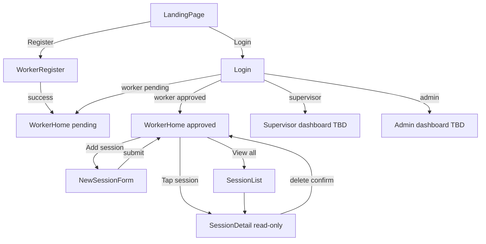

# Worker App Flow

User journey and screen specifications for community workers using the M&E tool on mobile.

**Related:** [PRD](../../server/docs/prd.md) · [Routes](../routes.md) · [FE-GUIDELINES](../../FE-GUIDELINES.md)

---

## Overview

- **Primary user:** Community worker on a mobile phone
- **Principles:** Single-fold landing, center-aligned forms, mobile-first (see [FE-GUIDELINES mobile rules](../../FE-GUIDELINES.md))
- **Session editing:** Workers cannot edit any previous session (PRD RBAC)
- **Terminology:**
  - **Auth session** — JWT stored client-side after login
  - **Community session** — A logged session row in the database (`sessions` table)

---

## User journey

---

## Screens

Each screen includes: route, layout, actions, API calls, and mobile notes.

### 1. Landing

| | |
| --- | --- |
| **Route** | `/` |
| **Auth** | Public |

**Layout**

- Single viewport fold (`min-h-dvh`) — no scroll required on 375px width
- Clean hero with product name and short tagline
- Header: **Register** and **Login** buttons in the **top-left** (not top-right)
- Minimal content — one fold only

**Actions**

| Action | Destination |
| --- | --- |
| Register | `/register` |
| Login | `/login` |

**API:** None

**Mobile notes:** Test at 375px; no horizontal overflow.

---

### 2.1 Worker registration

| | |
| --- | --- |
| **Route** | `/register` |
| **Auth** | Public |
| **Audience** | Workers only ([PRD §3](../../server/docs/prd.md)) |

**Layout**

- Center-aligned form: `max-w-sm mx-auto p-4`
- Visible labels on every field (not placeholder-only)
- Field-level error messages below inputs

**Form fields** (from `server/src/modules/workers/workers.schema.ts`)

| Field | Type | Validation |
| --- | --- | --- |
| name | text | required |
| age | number | positive integer |
| gender | select | `female`, `male`, `prefer_not_to_say` |
| phone | text | required |
| password | password | min 8 characters |
| organisation | select | `BONEPWA`, `MAHALAYPEE` |
| workerRole | select | `CDO`, `SW`, `CHW`, `other` |
| education | select | server enum |
| district | select | server enum |
| villages | multi-select | min 1; from server constants |
| consentGiven | checkbox | must be `true` |

**Actions**

| Action | Result |
| --- | --- |
| Submit | `POST /auth/register` → receive JWT → redirect to `/worker` |
| Back | `/` |

**Post-submit:** Worker status is `pending`. User is logged in but cannot add sessions until admin approves.

**API:** `POST /auth/register`

**Mobile notes:** Primary submit button `h-11` (44px touch target). Base text 16px.

---

### 2.2 Login

| | |
| --- | --- |
| **Route** | `/login` |
| **Auth** | Public |
| **Audience** | Worker, supervisor, admin |

**Layout**

- Center-aligned form: `max-w-sm mx-auto p-4`
- Identifier field: phone **or** system_id (e.g. `CW0001`, `SUP01`, `ADMIN`) — single input, label "Phone or System ID"
- Password field

**Actions**

| Action | Result |
| --- | --- |
| Submit | `POST /auth/login` → JWT → redirect by role |
| Back | `/` |

**Post-login redirects**

| Role | Destination |
| --- | --- |
| worker | `/worker` |
| supervisor | `/supervisor` (TBD) |
| admin | `/admin` (TBD) |

**API:** `POST /auth/login`

**Mobile notes:** Submit button `h-11`. See [Backend gaps](#backend-gaps--future-work) for identifier support.

---

### 3. Worker home

| | |
| --- | --- |
| **Route** | `/worker` |
| **Auth** | JWT, role `worker` |

Same route for pending and approved workers; content differs by `workers.status`.

#### 3a. Pending (`status = pending`)

Shown after registration or login while awaiting admin approval.

**Layout**

- Welcome message with worker name
- Status banner: "Awaiting admin approval — you cannot log sessions yet"
- Optional read-only profile summary from `GET /me`

**Actions**

- **Add session:** hidden or disabled
- **Previous sessions:** not shown (or empty state)

**API:** `GET /me`

#### 3b. Approved (`status = approved`)

Primary worker hub.

**Layout**

- Greeting + worker name
- Primary CTA: **Add new session** (`h-11`)
- **Previous sessions** list — compact cards showing date, village, topic, total reached
- Link to full list: "View all sessions"

**Actions**

| Action | Destination |
| --- | --- |
| Add new session | `/worker/sessions/new` |
| Tap session card | `/worker/sessions/:id` |
| View all sessions | `/worker/sessions` |

**API:** `GET /me`, `GET /sessions` (recent subset on home)

**Empty state:** "No sessions yet" with CTA to add first session.

**Mobile notes:** Card list scrolls vertically; primary CTA fixed or prominent at top.

---

### 4. New session

| | |
| --- | --- |
| **Route** | `/worker/sessions/new` |
| **Auth** | JWT, role `worker`, status `approved` |

**Layout**

- Center-aligned form, full-width on mobile with `p-4`
- Show computed `totalReached` as user fills attendance fields

**Form fields** (from `server/src/modules/sessions/sessions.schema.ts`)

| Field | Type | Validation |
| --- | --- | --- |
| sessionDate | date | `YYYY-MM-DD`, not in future |
| village | select | must be in worker's `villages` |
| topic | select | server enum |
| topicOther | text | required when topic is `other` |
| durationMin | number | 10–300 minutes |
| nWomen, nMen, nGirls, nBoys, nElders, nOthers | number | min 0; at least one must be > 0 |
| keyIssues | textarea | optional |

**Actions**

| Action | Result |
| --- | --- |
| Submit | `POST /sessions` → redirect to `/worker` |
| Cancel | `/worker` |

**Blocked state:** Pending workers redirected or shown approval banner; submit disabled.

**API:** `POST /sessions`

**Mobile notes:** Use number inputs with large touch targets. Field errors below each input.

---

### 5. Session list

| | |
| --- | --- |
| **Route** | `/worker/sessions` |
| **Auth** | JWT, role `worker` |

**Layout**

- Scrollable list of session cards (same pattern as worker home)
- Each card: date, village, topic, total reached

**Actions**

| Action | Destination |
| --- | --- |
| Tap card | `/worker/sessions/:id` |
| Add session | `/worker/sessions/new` (approved only) |
| Back | `/worker` |

**API:** `GET /sessions`

**Empty state:** "No sessions yet" + CTA to add.

---

### 6. Session detail

| | |
| --- | --- |
| **Route** | `/worker/sessions/:id` |
| **Auth** | JWT, role `worker`, own session only |

**Layout**

- Read-only display of all session fields
- **No edit UI** — workers cannot update sessions

**Actions**

| Action | Result |
| --- | --- |
| Delete | Confirmation dialog → `DELETE /sessions/:id` → `/worker` or `/worker/sessions` |
| Back | `/worker` or `/worker/sessions` |

**API:** `GET /sessions/:id`, `DELETE /sessions/:id`

**Mobile notes:** Delete button secondary/destructive styling; confirm dialog prevents accidental taps.

---

## Actions matrix (worker)

| Action | Allowed | API | Notes |
| --- | --- | --- | --- |
| Register | Yes | `POST /auth/register` | Workers only |
| Login | Yes | `POST /auth/login` | All roles; see backend gap for identifier |
| Add session | Approved only | `POST /sessions` | Blocked when `status = pending` |
| List own sessions | Yes | `GET /sessions` | |
| View session detail | Yes | `GET /sessions/:id` | Read-only |
| Delete own session | Yes | `DELETE /sessions/:id` | Confirm before delete |
| Edit session | **No** | — | PRD: workers cannot update |

---

## Mobile design requirements

Worker screens follow [FE-GUIDELINES mobile rules](../../FE-GUIDELINES.md):

- Base text 16px — never shrink body text below 16px on forms
- Touch targets ≥ 44px on primary CTAs (`h-11`)
- Center-aligned forms: `max-w-sm mx-auto p-4`
- Visible labels — not placeholder-only
- Errors shown below the related field
- No horizontal scroll — test at 375px width
- Use `min-h-dvh`, not `min-h-screen`

---

## Backend gaps / future work

> These are documented as target UX. Backend changes are planned for a later build.

**Login identifier**

- UI accepts phone OR system_id in a single field
- Current backend (`server/src/modules/auth/auth.schema.ts`) only accepts `phone + password`
- Future: extend `loginSchema` and `AuthService.login()` to resolve user by phone or `system_id`

**Supervisor / admin dashboards**

- Login redirect targets (`/supervisor`, `/admin`) are placeholders
- Screen specs for those roles are out of scope in this doc

**Token expiry**

- No refresh token (per PRD)
- JWT lives in HttpOnly cookie (see [server/docs/auth.md](../../server/docs/auth.md))
- On 401 response: call logout API, invalidate `me` cache, redirect to `/login`

---

## Config / dropdowns

Registration and session forms use server constants (`server/src/constants/index.ts`):

- Organisations, villages, districts, topics, gender, worker roles, education

Options:

1. Fetch `GET /config` when available
2. Hardcode enum labels in FE v1 (must match server constants)

Village dropdown on new session must be filtered to the worker's assigned `villages` from `GET /me`.