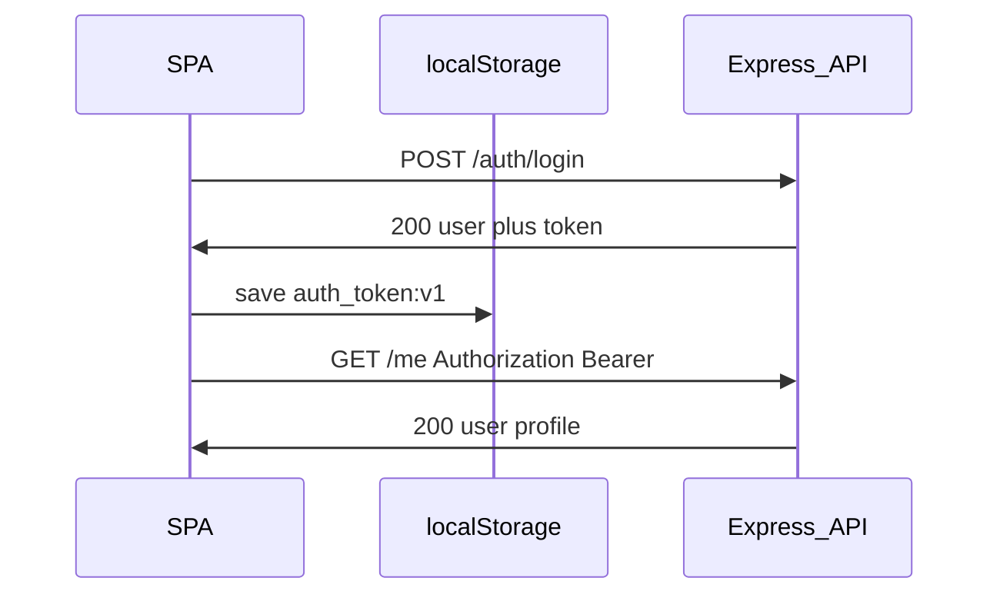

# Authentication — Bearer JWT

Authoritative contract for browser and API auth in the Community Worker M&E Tool.

**Related:** [prd.md](./prd.md) · [architecture.md](./architecture.md) · [backend_rules.md](./backend_rules.md)

---

## Model

- Users log in with **phone or system_id** plus **password** (all roles). Provide exactly one identifier in the request body.
- Workers **cannot** log in until an admin has approved their account (`workers.status = approved`).
- Registration does **not** authenticate the user — no JWT is issued on register.
- Server signs a **JWT** and returns it in the login JSON body. The SPA stores it in **localStorage** and sends `Authorization: Bearer <token>` on each request.
- **No refresh token** — when the JWT expires, the user logs in again.
- **No server-side session** — logout clears client storage; the JWT remains valid until expiry (stateless).

Auth state is inferred via `GET /me` (200 = logged in, 401 = not).

---

## Login request body

Provide **exactly one** of `phone` or `systemId`, plus `password`:

```json
{ "phone": "+267...", "password": "..." }
```

```json
{ "systemId": "CW0001", "password": "..." }
```

| Case | Status | Message |
| --- | --- | --- |
| Bad credentials | 401 | `Invalid credentials` |
| Worker pending approval | 403 | `Account pending admin approval` |
| Worker rejected | 403 | `Account has been rejected` |
| Both or neither identifier | 400 | Zod validation error |

---

## Endpoints

| Method | Path | Access | Response body |
| --- | --- | --- | --- |
| POST | `/auth/login` | Public | `{ user, token }` |
| POST | `/auth/register` | Public | `{ user, worker }` — no `token` |
| POST | `/auth/logout` | Public | `{ success: true }` |
| GET | `/me` | Authenticated (`Bearer`) | User profile (includes `worker` for workers) |

All protected routes use `requireAuth`, which reads `Authorization: Bearer <token>`.

---

## Request flow



---

## Environment variables

| Variable | Default | Purpose |
| --- | --- | --- |
| `JWT_SECRET` | (required) | Sign and verify JWTs |
| `JWT_EXPIRES_IN` | `7d` | Token lifetime |
| `CORS_ORIGINS` | `http://localhost:5173` | Comma-separated allowed SPA origins |

---

## Backend implementation

- **`server/src/lib/auth-token.ts`** — `getBearerToken(req)` parses `Authorization` header.
- **`server/src/middleware/require-auth.ts`** — verifies JWT, sets `req.user`.
- **`server/src/modules/auth/auth.controller.ts`** — login returns `{ user, token }`; logout returns `{ success: true }`.
- **`server/src/app.ts`** — CORS with explicit origins (no `credentials` required for Bearer).

---

## Frontend contract

- Store token in `localStorage` under key `auth_token:v1` (see `client/src/lib/auth-token.ts`).
- Axios request interceptor attaches `Authorization: Bearer <token>`.
- On 401 (except `/auth/login`), clear stored token.
- Login: save token from login response, then `GET /me`.
- Logout: clear localStorage and React Query `me` cache; optional `POST /auth/logout`.
- Base URL: `/api` in dev (Vite proxy); full Render URL in production (cross-origin OK with Bearer).

See [client/FE-GUIDELINES.md](../../client/FE-GUIDELINES.md).

---

## Local development

Vite proxies `/api` → `http://localhost:3000`. Bearer auth works the same whether proxied or cross-origin.

---

## Security notes

- Never log JWTs or passwords.
- **XSS:** JWT in `localStorage` is readable by any injected script. Mitigate with dependency hygiene and no unsafe HTML injection. Acceptable tradeoff for this pilot (Amplify + Render cross-origin).
- **CSRF:** Not applicable — token is not sent automatically by the browser (unlike cookies).
- Production: set `CORS_ORIGINS` to exact Amplify URL(s); no wildcard.

---

## Postman / scripts

1. `POST /auth/login` → copy `token` from JSON.
2. Set `Authorization: Bearer <token>` on protected requests.
3. Collection variables `adminToken`, `supervisorToken`, `workerToken` are populated by login test scripts.
