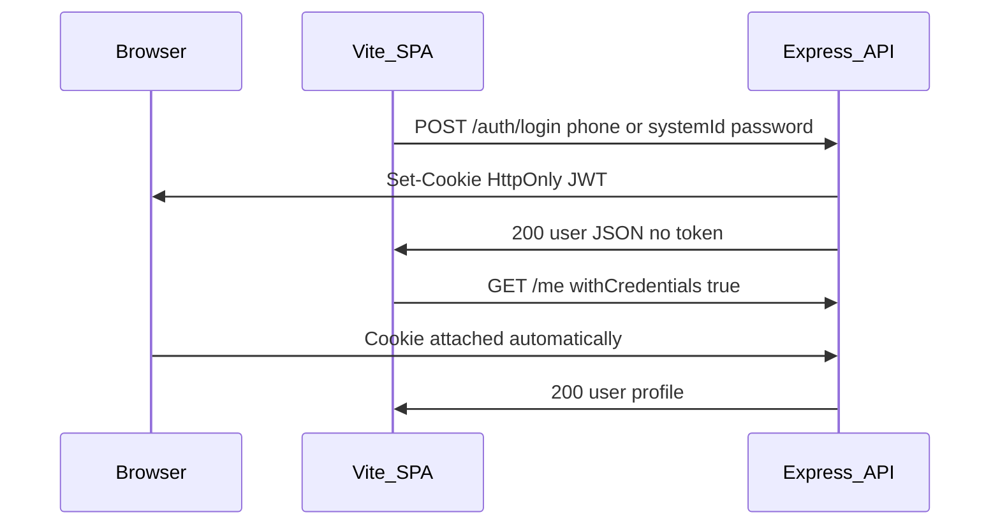

# Authentication — HttpOnly Cookie JWT

Authoritative contract for browser and API auth in the Community Worker M&E Tool.

**Related:** [prd.md](./prd.md) · [architecture.md](./architecture.md) · [backend_rules.md](./backend_rules.md)

---

## Model

- Users log in with **phone or system_id** plus **password** (all roles). Provide exactly one identifier in the request body.
- Workers **cannot** log in until an admin has approved their account (`workers.status = approved`).
- Registration does **not** authenticate the user — no JWT is issued on register.
- Server signs a **JWT** and stores it in an **HttpOnly cookie** — the browser sends it automatically on each request.
- **No refresh token** — when the JWT expires, the user logs in again.
- **Browser clients** must not receive the JWT in JSON response bodies.
- **API tooling** (Postman, scripts) may use `Authorization: Bearer <token>` as a secondary path in `requireAuth`.

The frontend never reads, stores, or manually attaches the JWT. Auth state is inferred via `GET /me` (200 = logged in, 401 = not).

---

## Login request body

Provide **exactly one** of `phone` or `systemId`, plus `password`:

```json
{ "phone": "+267...", "password": "..." }
```

```json
{ "systemId": "CW0001", "password": "..." }
```

| Case | Status | Message |
| --- | --- | --- |
| Bad credentials | 401 | `Invalid credentials` |
| Worker pending approval | 403 | `Account pending admin approval` |
| Worker rejected | 403 | `Account has been rejected` |
| Both or neither identifier | 400 | Zod validation error |

---

## Cookie specification

| Attribute | Development | Production |
| --- | --- | --- |
| Name | `AUTH_COOKIE_NAME` env, default `auth_token` | same |
| HttpOnly | `true` | `true` |
| Secure | `false` (localhost) | `true` |
| SameSite | `Lax` (use Vite `/api` proxy so FE + API are same-origin) | `Lax` or `None` if SPA and API are on different sites (`None` requires `Secure`) |
| Path | `/api` | `/api` |
| Max-Age | Match `JWT_EXPIRES_IN` | Match `JWT_EXPIRES_IN` |

---

## Endpoints

| Method | Path | Access | Cookie behavior | Response body |
| --- | --- | --- | --- | --- |
| POST | `/auth/login` | Public | **Set** auth cookie | `{ user }` — no `token` |
| POST | `/auth/register` | Public | No cookie (pending worker) | `{ user, worker }` — no `token` |
| POST | `/auth/logout` | Public | **Clear** auth cookie (`Max-Age=0`) | `{ success: true }` or `204` |
| GET | `/me` | Authenticated | Read JWT from cookie | `{ user }` or user profile shape |

All other protected routes use the same cookie via `requireAuth`.

---

## Request flow



---

## Environment variables

Add to `server/src/config/env.ts` (implementer checklist):

| Variable | Default | Purpose |
| --- | --- | --- |
| `AUTH_COOKIE_NAME` | `auth_token` | Cookie name |
| `COOKIE_SECURE` | `false` in dev, `true` in prod | `Secure` flag |
| `COOKIE_SAME_SITE` | `lax` | `SameSite` attribute (`lax` \| `strict` \| `none`) |

Existing: `JWT_SECRET`, `JWT_EXPIRES_IN`, `CORS_ORIGINS`.

---

## Backend implementation checklist

> **Status:** Documented for implementation. Code may still return `token` in JSON until this checklist is complete.

1. **Install** `cookie-parser` and `@types/cookie-parser`.
2. **`server/src/app.ts`** — `app.use(cookieParser())` before routes; CORS already has `credentials: true`.
3. **`server/src/config/env.ts`** — add `AUTH_COOKIE_NAME`, `COOKIE_SECURE`, `COOKIE_SAME_SITE`.
4. **`server/src/lib/auth-cookie.ts`** (new) — helpers: `setAuthCookie(res, token)`, `clearAuthCookie(res)`, `getTokenFromRequest(req)`.
5. **`server/src/middleware/require-auth.ts`** — read cookie first, fall back to `Authorization: Bearer`.
6. **`server/src/modules/auth/auth.controller.ts`** — on login/register: `setAuthCookie`, omit `token` from JSON; add `logout` handler.
7. **`server/src/modules/auth/auth.routes.ts`** — `POST /logout`.
8. **Helmet** — default config is fine; do not disable cookies.
9. **CORS** — origins must be explicit (not `*` in production); `credentials: true` required.

---

## Frontend contract

- Axios instance: `withCredentials: true` on every request.
- **No** `Authorization` header interceptor for browser flows.
- **No** `localStorage` for JWT.
- Base URL: `/api` in dev (Vite proxy to `localhost:3000`).
- Auth state: `GET /me` via React Query; 401 → redirect to `/login`.
- Logout: `POST /auth/logout` then clear React Query `me` cache.

See [client/FE-GUIDELINES.md](../../client/FE-GUIDELINES.md).

---

## Local development

Vite dev server proxies `/api` → `http://localhost:3000` so cookies are same-origin (`localhost:5173/api/...`). Without the proxy, cross-origin cookies require `SameSite=None; Secure` and HTTPS.

---

## Security notes

- Never log cookie values or JWTs.
- Never return JWT in login/register JSON for browser clients.
- **CSRF:** `SameSite=Lax` + same-site deploy is sufficient for pilot. If cross-site POST is required later, add CSRF tokens.
- **XSS:** HttpOnly cookie prevents JS from reading the token (unlike `localStorage`).

---

## Postman / scripts

- After login, use Postman cookie jar **or** copy token from a dedicated dev-only endpoint is **not** supported — use `Authorization: Bearer` if you have a token from a test helper.
- Collection may keep `Bearer {{workerToken}}` for manual testing until cookie-based login is scripted in Postman.
