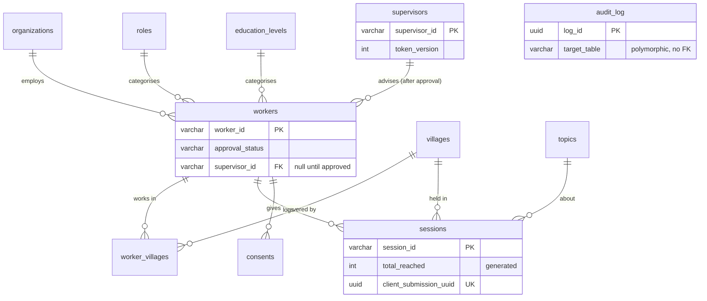

# Database Schema

Source-of-truth for the data model of the Community Worker M&E tool. Describes every table, column, constraint, and relationship as the schema should exist in `src/db/schema/`.

**Related docs:**

- [architecture.md](./architecture.md) — folder structure, DB layer, migrations
- [backend_rules.md](./backend_rules.md) — schema file conventions, type rules
- [community_worker_me_tool_PRD.md](./community_worker_me_tool_PRD.md) — functional + compliance requirements behind these tables

**Stack:** PostgreSQL 16 · Drizzle ORM · postgres.js

---

## Conventions

Following `backend_rules.md`:

- **One file per table** in `src/db/schema/<table>.ts`, re-exported from `src/db/schema/index.ts`.
- **No TS `enum`.** Fixed value sets are `as const` string-literal unions in TS and enforced at the DB level with `CHECK` constraints (not `pgEnum`), so values stay greppable and migrations stay simple.
- **Editable value sets are lookup tables**, not constraints (roles, education levels, organizations, villages, topics) — the super admin edits these at runtime.
- **Types are inferred**, never hand-written: `typeof workers.$inferSelect` / `$inferInsert`.
- **Timestamps are `timestamptz`** (`timestamp({ withTimezone: true })`), defaulting to `now()` where noted.
- **Migrations:** edit schema → `npm run db:generate` → review SQL in `drizzle/` → `npm run db:migrate` → commit. Never hand-write migrations.

### Fixed value sets (CHECK-enforced)

| Set | Values | Used by |
|-----|--------|---------|
| `sex` | `F` · `M` · `PNS` | `workers.sex` |
| `approval_status` | `pending` · `active` · `rejected` | `workers.approval_status` |
| `supervisor_type` | **TBD — pending confirmation of the two types** | `supervisors.type` |
| `audit_action` | `login` · `export` · `edit` · `delete` · `assign` · `approve` · `reject` · `consent_withdraw` · `erase` | `audit_log.action` |
| `audit_actor_type` | `supervisor` · `super_admin` · `system` | `audit_log.actor_type` |
| `consent_scope` | `research` · `monitoring` · `cross_border_transfer` | `consents.scope` |

---

## Entity relationship diagram



`audit_log` references other entities polymorphically (`target_table` + `target_id`) and has no hard foreign keys, so it is shown standalone.

---

## Tables

### `workers`

The community workers. The only large personal-data table. Lifecycle: `pending` → `active` (super admin approves **and** assigns a supervisor in one action) or `rejected`; an `active` worker can later be deactivated (`is_active = false`) or erased (`deleted_at`).

| Column | Type | Constraints | Notes |
|--------|------|-------------|-------|
| `worker_id` | varchar | **PK** | Format `CW0001`, generated via sequence (see ID generation) |
| `full_name` | varchar | NOT NULL | Free text |
| `org_id` | varchar | **FK** → `organizations.org_id`, NOT NULL | Controlled dropdown |
| `role_id` | varchar | **FK** → `roles.role_id`, NOT NULL | Editable lookup |
| `role_other` | varchar | NULL | Required iff role = Other (app-level) |
| `sex` | varchar | NOT NULL, CHECK ∈ `sex` set | Fixed union |
| `age` | int | NOT NULL, CHECK 18–80 | |
| `education_id` | varchar | **FK** → `education_levels.education_id`, NOT NULL | Editable lookup |
| `phone_encrypted` | text | NOT NULL | App-level encrypted at rest; never in views/exports (C4) |
| `pin_hash` | text | NULL | 4-digit PIN, hashed (argon2id/bcrypt); gates worker JWT issuance |
| `token_version` | int | NOT NULL, default 0 | Bumped on deactivation/erasure/PIN reset → invalidates issued JWTs |
| `training_date` | date | NOT NULL | |
| `supervisor_id` | varchar | **FK** → `supervisors.supervisor_id`, NULL | NULL until approval; set by super admin |
| `approval_status` | varchar | NOT NULL, default `pending`, CHECK ∈ `approval_status` set | Registration → `pending` |
| `approved_at` | timestamptz | NULL | Set when status → `active` |
| `registered_at` | timestamptz | NOT NULL, default `now()` | |
| `is_active` | boolean | NOT NULL, default true | Deactivation axis (distinct from approval) |
| `deleted_at` | timestamptz | NULL | Erasure marker (C3); anonymize personal fields when set |

**Indexes:** `(supervisor_id)`, `(approval_status)`, `(org_id)`.

---

### `worker_villages` (junction)

Replaces the array-of-villages from the original spec. Lets a worker work in multiple villages with full referential integrity, and powers the "session village must be one the worker is registered to" rule.

| Column | Type | Constraints |
|--------|------|-------------|
| `worker_id` | varchar | **FK** → `workers.worker_id`, NOT NULL |
| `village_id` | varchar | **FK** → `villages.village_id`, NOT NULL |
| — | — | **Composite PK** (`worker_id`, `village_id`) |

---

### `sessions`

Core data-collection table. Many rows per worker. Holds **only aggregate** attendance counts — never beneficiary identities.

| Column | Type | Constraints | Notes |
|--------|------|-------------|-------|
| `session_id` | varchar | **PK** | Format `SESS000001`, generated via sequence |
| `worker_id` | varchar | **FK** → `workers.worker_id`, NOT NULL | |
| `session_date` | date | NOT NULL | App rule: not in the future |
| `village_id` | varchar | **FK** → `villages.village_id`, NOT NULL | Must be in worker's `worker_villages` |
| `topic_id` | varchar | **FK** → `topics.topic_id`, NOT NULL | |
| `topic_other` | varchar | NULL | Required iff topic = Other |
| `duration_min` | int | NOT NULL, CHECK 10–300 | |
| `n_women` | int | NOT NULL, CHECK ≥ 0 | Women 18–59 |
| `n_men` | int | NOT NULL, CHECK ≥ 0 | Men 18–59 |
| `n_girls` | int | NOT NULL, CHECK ≥ 0 | <18 |
| `n_boys` | int | NOT NULL, CHECK ≥ 0 | <18 |
| `n_elders` | int | NOT NULL, CHECK ≥ 0 | 60+ |
| `n_others` | int | NOT NULL, CHECK ≥ 0 | |
| `total_reached` | int | **GENERATED ALWAYS AS** (sum of the six `n_*`) **STORED** | Never accepted from client |
| `key_issues` | text | NULL | Restricted access (C8); on-form warning against identifying details |
| `client_submission_uuid` | uuid | **UNIQUE**, NOT NULL | Offline-sync idempotency key |
| `submitted_at` | timestamptz | NOT NULL, default `now()` | |

**App-level rule (not a CHECK):** at least one `n_*` > 0 (total cannot be zero).
**Indexes:** `(worker_id)`, `(session_date)`, `(village_id)`, `(topic_id)`, plus the unique on `(client_submission_uuid)`.

---

### `supervisors`

Supervisor and super-admin accounts. (The super admin can be modelled as a supervisor row with an elevated role claim, or split out — see note below.)

| Column | Type | Constraints | Notes |
|--------|------|-------------|-------|
| `supervisor_id` | varchar | **PK** | Format `SUP001`, generated via sequence |
| `full_name` | varchar | NOT NULL | |
| `email` | varchar | **UNIQUE**, NOT NULL | Login identifier |
| `password_hash` | text | NOT NULL | argon2id/bcrypt; never stored plain, never logged |
| `type` | varchar | NOT NULL, CHECK ∈ `supervisor_type` set | **TBD — two types pending confirmation** |
| `token_version` | int | NOT NULL, default 0 | JWT revocation hook (deactivation/password reset) |
| `failed_login_count` | int | NOT NULL, default 0 | Throttling |
| `locked_until` | timestamptz | NULL | Set after repeated failures |
| `created_at` | timestamptz | NOT NULL, default `now()` | |
| `last_login` | timestamptz | NULL | |
| `is_active` | boolean | NOT NULL, default true | |

> **Role note:** role (`supervisor` vs `super_admin`) drives authorization and lives in the JWT claim. If you prefer it persisted, add a `role` column (CHECK in `supervisor`/`super_admin`); otherwise designate the super admin out-of-band. Decision tracked as an open item.

---

### `consents`

Proof of consent as a record, not a boolean (compliance C1). One row per consent event; withdrawable.

| Column | Type | Constraints | Notes |
|--------|------|-------------|-------|
| `consent_id` | uuid | **PK**, default `gen_random_uuid()` | |
| `worker_id` | varchar | **FK** → `workers.worker_id`, NOT NULL | |
| `consent_text` | text | NOT NULL | Exact wording shown to the worker |
| `consent_version` | varchar | NOT NULL | |
| `scope` | text[] | NOT NULL | Subset of `consent_scope` values |
| `given_at` | timestamptz | NOT NULL, default `now()` | |
| `withdrawn_at` | timestamptz | NULL | Set on withdrawal (audited) |

> `cross_border_transfer` appears in `scope` only when hosting is outside Botswana / a non-adequate region (compliance C2, decision DEC-1).

---

### Lookup tables

Editable at runtime by the super admin. Archiving keeps a value valid on existing records but hides it from new submissions.

#### `organizations`
| Column | Type | Constraints |
|--------|------|-------------|
| `org_id` | varchar | **PK** |
| `name` | varchar | NOT NULL |
| `is_archived` | boolean | NOT NULL, default false |

#### `roles`
| Column | Type | Constraints | Notes |
|--------|------|-------------|-------|
| `role_id` | varchar | **PK** | |
| `code` | varchar | NOT NULL | Stable short code: `CDO` · `SW` · `CHW` · `Other` |
| `name` | varchar | NOT NULL | Display name |
| `is_archived` | boolean | NOT NULL, default false | |

#### `education_levels`
| Column | Type | Constraints |
|--------|------|-------------|
| `education_id` | varchar | **PK** |
| `name` | varchar | NOT NULL |
| `is_archived` | boolean | NOT NULL, default false |

#### `villages`
| Column | Type | Constraints | Notes |
|--------|------|-------------|-------|
| `village_id` | varchar | **PK** | |
| `village_name` | varchar | NOT NULL | |
| `district` | varchar | NOT NULL | Hook for future multi-district scale-up |
| `is_archived` | boolean | NOT NULL, default false | |

#### `topics`
| Column | Type | Constraints |
|--------|------|-------------|
| `topic_id` | varchar | **PK** |
| `topic_name` | varchar | NOT NULL |
| `is_archived` | boolean | NOT NULL, default false |

---

### `audit_log`

Append-only. Written by a shared service helper (`recordAudit(...)`), never from controllers. The application DB role should have **no UPDATE/DELETE grant** on this table.

| Column | Type | Constraints | Notes |
|--------|------|-------------|-------|
| `log_id` | uuid | **PK**, default `gen_random_uuid()` | |
| `actor_type` | varchar | NOT NULL, CHECK ∈ `audit_actor_type` set | |
| `actor_id` | varchar | NULL | supervisor/admin id, or null for system |
| `action` | varchar | NOT NULL, CHECK ∈ `audit_action` set | |
| `target_table` | varchar | NOT NULL | Polymorphic reference |
| `target_id` | varchar | NOT NULL | |
| `metadata` | jsonb | NULL | e.g. applied export filters, before/after on edits |
| `created_at` | timestamptz | NOT NULL, default `now()` | |

**Index:** `(created_at)`, `(actor_id)`, `(target_table, target_id)`.

---

## ID generation

Human-readable IDs (`CW####`, `SESS######`, `SUP###`) MUST be generated atomically to avoid collisions. Use one Postgres `SEQUENCE` per prefix and zero-pad in the repository inside the same transaction as the insert:

```
CREATE SEQUENCE worker_id_seq;      -- CW + lpad(nextval, 4, '0')
CREATE SEQUENCE session_id_seq;     -- SESS + lpad(nextval, 6, '0')
CREATE SEQUENCE supervisor_id_seq;  -- SUP + lpad(nextval, 3, '0')
```

Never generate IDs in the controller or rely on client-supplied IDs.

---

## Relationships summary

| Child | Column | Parent | On delete |
|-------|--------|--------|-----------|
| `workers` | `org_id` | `organizations` | RESTRICT |
| `workers` | `role_id` | `roles` | RESTRICT |
| `workers` | `education_id` | `education_levels` | RESTRICT |
| `workers` | `supervisor_id` | `supervisors` | SET NULL |
| `worker_villages` | `worker_id` | `workers` | CASCADE |
| `worker_villages` | `village_id` | `villages` | RESTRICT |
| `sessions` | `worker_id` | `workers` | RESTRICT |
| `sessions` | `village_id` | `villages` | RESTRICT |
| `sessions` | `topic_id` | `topics` | RESTRICT |
| `consents` | `worker_id` | `workers` | CASCADE |

> Lookup parents use `RESTRICT` so an in-use value cannot be hard-deleted — archive instead. `sessions.worker_id` is `RESTRICT` so worker erasure is a deliberate anonymization, not a cascade that destroys M&E history.

---

## Open items reflected here

| Ref | Item | State in this schema |
|-----|------|----------------------|
| DEC-1 | Hosting region | `consents.scope` carries `cross_border_transfer` only if non-adequate region chosen |
| DEC-2 | Worker PIN | Included (`pin_hash`); JWT issuance gated on it |
| DEC-3 | `sex` editable? | Fixed CHECK set (not a lookup) |
| DEC-4 | JWT sessions | `token_version` on `workers` + `supervisors` for revocation |
| — | Supervisor types | `supervisors.type` present, **values TBD** |
| — | Persist `role`? | Optional `role` column noted; not yet added |
